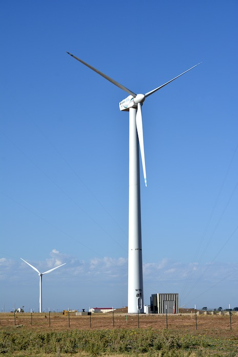
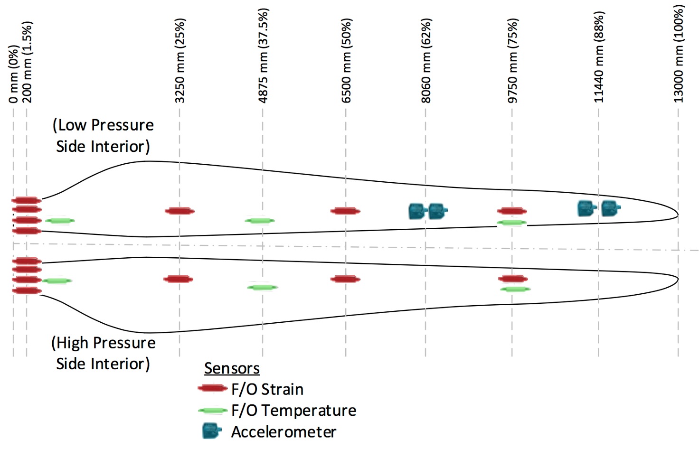
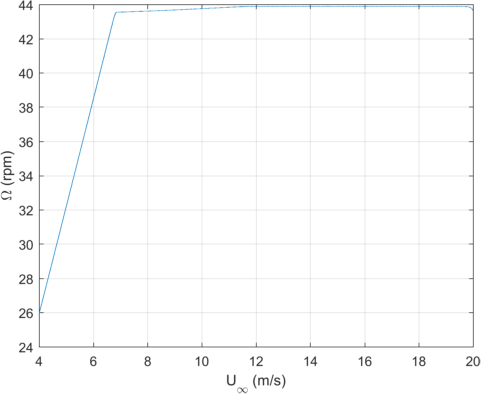
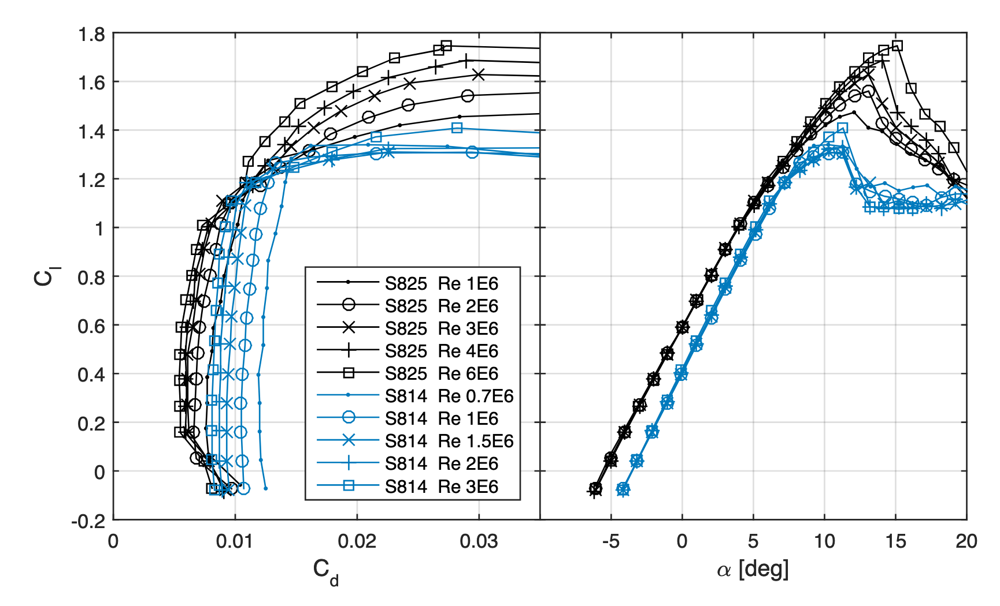
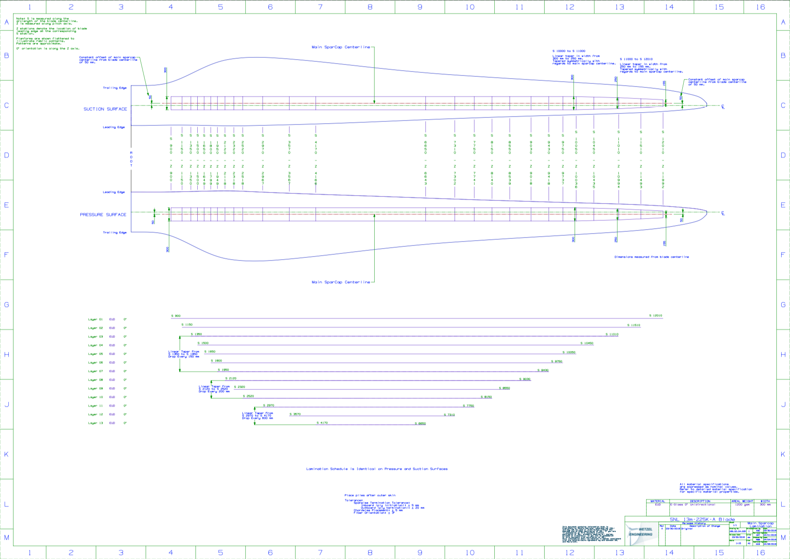
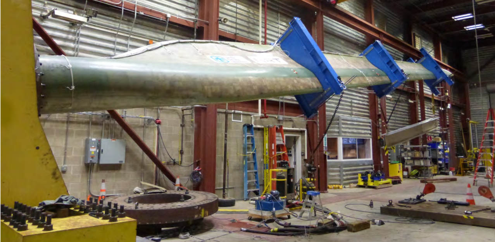

# NRT Summary 

- National Rotor Testbed design documentation is contained in this repository
- [Field experiment](https://www.osti.gov/servlets/purl/1489535) is ongoing at Sandia/DOE SWiFT Facility, Lubbock, Texas
- Aerodynamic and instrumentation design by Sandia 
- Final structural design and manufacturing drawings were provided by Wetzel Wind Energy Services
- TPI Composites manufactured 4 NRT Blades
- Oakridge National Laboratory 3D printed the NRT blade mold
- Structural testing conducted at NREL

# Purpose
- To conduct wind turbine wake experiments relevant to megawatt scale turbines
- To be an open, well-documented, and highly instrumented wind turbine rotor design for model validation
- To demonstrate new blade technology

# Aeroelastic Model
- Modelled in FAST version 7
- Simple controller model, torque proportional to the square of rotor speed  
- Blade masses updated to include ballast in balance boxes of each blade
- Airfoil lift, drag, and moment data from experimental wind tunnel testing 
- Model will continue to be updated during ongoing NRT experiment
- Please contact us for a detailed simulink model of the turbine controller

# Blade Instrumentation 
- Strain gages:
  - Micron Optics Fiber Optic OS3200
  - Spaced 45 degrees at root, high/low pressure side outboard
  - calibrated to measure aerodynamic bending moment
- Accelerometers:
  - Silicon Designs 2470
- Blade Temperature:
  - Micron Optics Fiber Optic OS4300
  - to compensate for thermal strain
  
  

# Blade Properties
- Length: 13 m
- Blade Mass: 551 kg per blade, including balance box ballast 
- Blade Center of Gravity: 4.04 m from root
- Construction: Fiberglass spar and skin
- Surface Roughness (Painted): Ra = 0.45 𝜇m, Rz = 2.57 𝜇m

# Regions of Operation
- Region 2:   4-6.9 m/s, 25.9-43.6 rpm, TSR = 9
- Region 2.5: 6.9-11.4 m/s, 43.6-43.9 rpm
- Region 3:   11.4-20 m/s, 43.9 rpm   
  
 

# Aerodynamic Design

- [Technical Report](https://www.osti.gov/biblio/1346410-aerodynamic-design-national-rotor-testbed)
- Same axial induction as GE 1.5sle for region 2 operation to create scaled wake
- [S825](https://www.nrel.gov/docs/fy05osti/36346.pdf) airfoil across outer 50% of rotor span
- [S814](https://wind.nrel.gov/airfoils/documents/S814_WTtest_OCR.pdf) airfoil at maximum chord, c = 1.5 m
- Airfoils operate at a lift coefficient of 0.6 in region 2  

  

# Structural Design
- [Mass, Stiffness, and Modal Analysis Report (.pdf)](Structure/WEI%20169.03.06.001-B-Sandia%2013m%20Blade_Structural%20Analysis%20Summary.pdf)
- [Beam Properties (.xlsx)](Structure/169.05.02.001-B-Aero+Structure%20Design%20Summary.xlsx?raw=true)
- [Material Properties and Standards (.xlsx)](Structure/169.03.03.001-A_Sandia_13.0m%20Blade%20Materials%20and%20Test%20Standards_2016-02-....xlsx?raw=true)
- [3D CAD Models](Structure/3D%20CAD%20Models)
- [Manufacturing Drawings](Structure/Design%20Drawings)
- Note, the root plane was cut to add 0.5° of forward sweep to reduce nose down pitching moment about the blade pitch axis

  

# Static Test at NREL Structural Testing Lab
[//]: # (- [Technical Report (.pdf)](Documents/NRT%20Blade%20Laboratory%20Structural%20Test%20Report.pdf))

- Proof Tests:
  - maximum and mininum edge loads
  - maximum and mininum flap loads
  - fatigue test in flap direction
  - ultimate flap load to failure
    
  
  
# SWiFT Site Documentation
- [SWiFT Site Overview](https://energy.sandia.gov/programs/renewable-energy/wind-power/wind_plant_opt/)
- [Wind Resource](https://www.osti.gov/biblio/1237403-swift-site-atmospheric-characterization)

# Point of Contact
Chris Kelley  
clkell@sandia.gov

# References
C. Kelley, "Aerodynamic Design of the National Rotor Testbed," Sandia National Laboratories Technical Report, [SAND2015-8989](https://www.osti.gov/biblio/1346410-aerodynamic-design-national-rotor-testbed).  

C. Kelley, B. Naughton, "NRT Design Verification Test Plan," Sandia National Laboratories Technical Report, [SAND2018-14254](https://www.osti.gov/biblio/1346410-aerodynamic-design-national-rotor-testbed).  

C. Kelley, "National Rotor Testbed Overview for DOE Science Panel," Project Presentation, [SAND2017-4446PE](https://www.osti.gov/servlets/purl/1431697).

# Copyright
Copyright 2020 National Technology & Engineering Solutions of Sandia, 
LLC (NTESS). Under the terms of Contract DE-NA0003525 with NTESS, the U.S. 
Government retains certain rights.
 
NRT design documentation is distributed in the hope that it will be useful, but without any 
warranty; without even the implied warranty of merchantability or fitness for a 
particular purpose.
